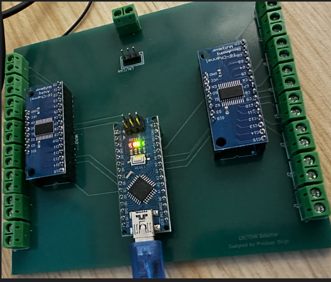
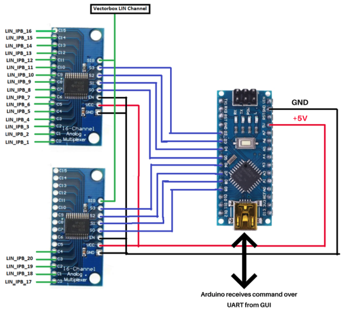
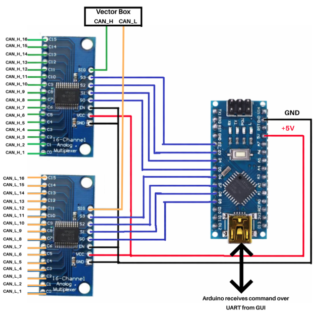
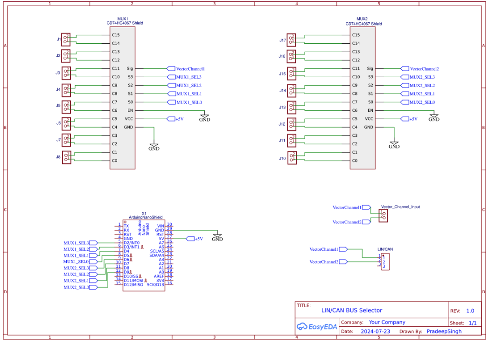
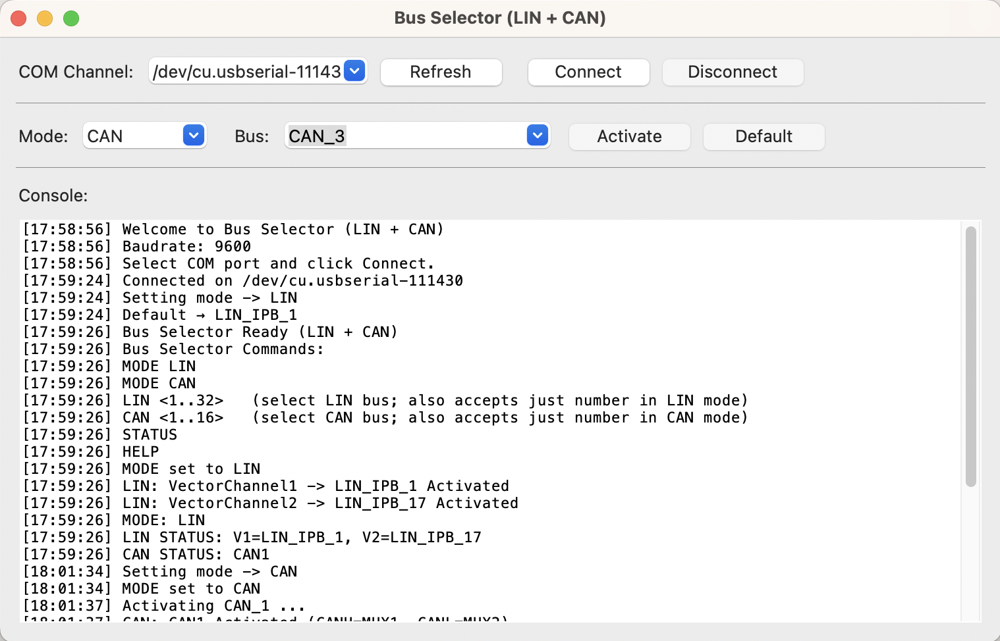

# ECU Bus Selector (LIN + CAN)

Hardware-software tool for remotely switching multiple ECU CAN/LIN buses
to limited Vector channels using Arduino and analog multiplexers.

------------------------------------------------------------------------

## 📌 Overview

The ECU Bus Selector is a custom-built embedded tool designed to
simplify automotive debugging by dynamically routing multiple ECU CAN or
LIN buses to limited Vector hardware channels.

The system consists of:

-   Custom PCB with Arduino Nano
-   Two CD74HC4067 16-channel analog multiplexers
-   Python-based desktop GUI
-   Serial communication over USB

This enables remote and flexible bus switching without manual rewiring.

------------------------------------------------------------------------

# 🖼 Project Visuals

## 🔷 Physical Setup

------------------------------------------------------------------------

## 🔷 System Block Diagram

LIN System Overview

CAN System Overview

------------------------------------------------------------------------

## 🔷 Hardware Schematic

------------------------------------------------------------------------

## 🔷 GUI Application

------------------------------------------------------------------------

## 🚗 Problem Statement

During ECU debugging:

-   Multiple CAN/LIN buses exist on the ECU
-   Vector hardware provides limited channels
-   Manual rewiring is time-consuming and error-prone

This tool provides a cost-effective and scalable solution for remotely
selecting any ECU bus and mapping it to available Vector channels.

------------------------------------------------------------------------

## 🧠 System Architecture

### LIN Mode

-   LIN1--LIN16 → VectorChannel1 (MUX1)
-   LIN17--LIN32 → VectorChannel2 (MUX2)

### CAN Mode

-   1 Vector CAN Channel used
-   MUX1 routes CAN_H
-   MUX2 routes CAN_L
-   CAN1--CAN16 supported
-   Both muxes switch together to maintain differential integrity

------------------------------------------------------------------------

## 🛠 Hardware Components

-   Arduino Nano
-   2 × CD74HC4067 16-channel analog multiplexers
-   Custom PCB
-   Vector CAN/LIN Interface

------------------------------------------------------------------------

## 💻 Software Components

### Arduino Firmware

Supported Commands:

MODE LIN\
MODE CAN\
LIN \<1..32\>\
CAN \<1..16\>\
STATUS\
HELP

### Python GUI

Features:

-   COM port selection
-   Mode selection (LIN / CAN)
-   Bus selection dropdown
-   Serial console feedback
-   Default bus activation

------------------------------------------------------------------------

## 🔌 Pin Mapping

MUX1 (D2--D5): - S3 → D2 - S2 → D3 - S1 → D4 - S0 → D5

MUX2 (D6--D9): - S3 → D6 - S2 → D7 - S1 → D8 - S0 → D9

EN pins are tied to GND (always enabled).

------------------------------------------------------------------------

## 🚀 How to Use

1.  Flash Arduino with unified Bus Selector firmware.
2.  Connect board via USB.
3.  Launch Python GUI.
4.  Select COM port and click Connect.
5.  Choose Mode (LIN or CAN).
6.  Select desired bus and activate.
7.  Monitor traffic in Vector / BusMaster.

------------------------------------------------------------------------

## ✅ Benefits

-   Remote bus switching
-   No manual rewiring
-   Cost-effective solution
-   Scalable hardware design
-   Supports both LIN and CAN
-   Professional debugging workflow integration

------------------------------------------------------------------------

## 📄 License

This project is open-source and intended for educational and
professional portfolio use.
